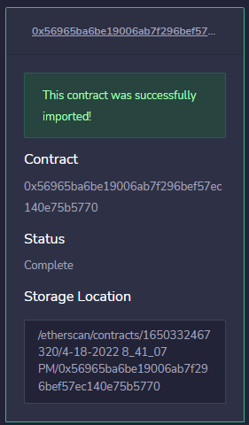
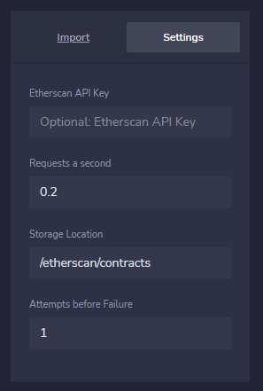
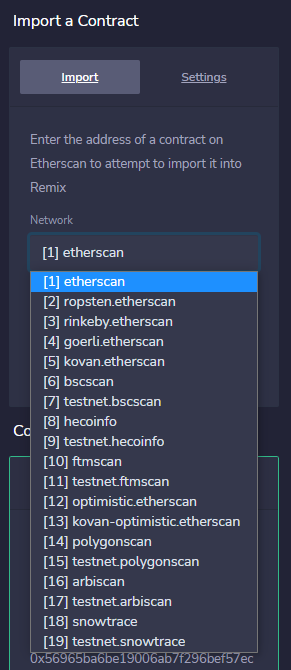
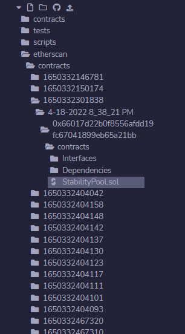
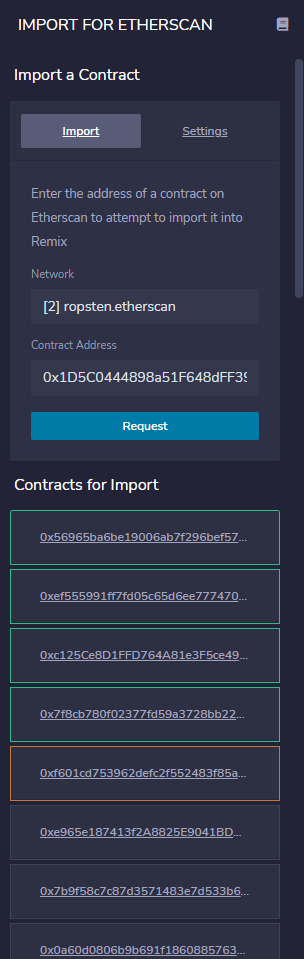

# Etherscan Import for Remix

A plugin for the [Remix IDE](https://github.com/ethereum/remix-ide) that makes it easy to import contracts from [Etherscan](https://etherscan.io/) websites.

# Import with list

Contracts can also be imported by using comma separated lists. As an example, the following contract list will work if just copied an pasted into plugin input for the **Contract Address**
```
0x23c45C33BE424CD2500323739bbA08a1CfD51217, 0xa9cc3aa847dfe26d9f4ae1b8aeb50368a840a663, 0xa6afcb5824506c1f441b17434663917ba42109f6, 0xfD0955B7DC15D892EbD42dB32BaBb1066E9bEb24, 0xaeb07103c7ef55a8109bfbc50673dd5616deef7a, 0x07b8119c3a96ac930d7ffc0fd8f1f8476e1634b5, 0x39275062896c003c0646b07c37c94358dabcd4bc, 0xc3e54e0f0c0061ded623e82e2604870a3776f8d4, 0xC2fFa5D4Ad0d1d87a6B0e1557A5be50Ed4e926FB, 0xb9d29759f6d8412304a4197360a9727e801b2bf2, 0xeaF7888880a308dBD13Ae74d1567Cc20E1FF4F74, 0x3d3718a2307a99939d0cc3ae0257b3f7554af8c4, 0x110d1e1e152aed223c011100653672240b1046cf, 0xCFaFD32E51DC4A944C428Ac83e61e717Bd8FECE8, 0x74058ef73d97af7d8075ccb96220e47506fec6bb, 0x3426ea54f252ecf893b4907f3bbb72833ff4cc47, 0xb7c95518143b64a6da9ed07aeb16f656fc86b53f, 0x9cccA4857336182CC28b649e1F92b1aEDe77a33f, 0x62ca828e17b9c3C36D3bCFe0bf6C474355f67C71, 0x4400b11340187a9469581D4AfEf355337DB8f062, 0x0dc1257e962d148c012b6faa3767f3d8164e7c32, 0x18DD805608B01Fa029B3ca0C35b576ACA27D6f72, 0x8e8e4726a043d98e5fb3dd9a604e57c3c7e218f1, 0x923a3b4e9c1c1da42401f1bded453d3ad5e54c5b, 0xc84d8d03aa41ef941721a4d77b24bb44d7c7ac55
```

# Proxy support

If Etherscan reports that a requested contract is a proxy, then **the plugin will automatically pull the implementation versions of the contract too**.

# Import by URL

**If this plugin is included by default in Remix,** it is possible to import a contract by setting parameters in the URL. 

The format to complete this is 

```
https://{IDE_Address}#activate={plugin_name}&call={plugin_name}//loadContract//{requested_address_list}//{network}
```

The official Remix client **does not include this plugin by default yet**, however, **it is included as a default plugin for the remix client at** 

```
https://radiantgradient.org/remix/ide
```

[Example without setting the network (defaults to etherscan)](https://radiantgradient.org/remix/ide#activate=etherscan-import&call=etherscan-import//loadContract//0x66017d22b0f8556afdd19fc67041899eb65a21bb)
```
https://radiantgradient.org/remix/ide#activate=etherscan-import&call=etherscan-import//loadContract//0x66017d22b0f8556afdd19fc67041899eb65a21bb
```

[Example with a set network (using ropsten)](https://radiantgradient.org/remix/ide#activate=etherscan-import&call=etherscan-import//loadContract//0x56f62375CB5d0d4BAC2A6C928CC360Cbf059d246//2)
```
https://radiantgradient.org/remix/ide#activate=etherscan-import&call=etherscan-import//loadContract//0x56f62375CB5d0d4BAC2A6C928CC360Cbf059d246//2
```

[Example with a contract list](https://radiantgradient.org/remix/ide#activate=etherscan-import&call=etherscan-import//loadContract//0x1D5C0444898a51F648dFF3926D6AC0dAf19931Ed,0xAfc4FeE8Ff14EDe9203CF4Ebbd5fEB1cc3f5c06D,0x4f6fdc8137c9a417fb09c7e04f6554a84df9adc5,0x45cd215365cdf384ea65a65927501e6a40571266,0xb04a6bc1368f6792d1dff494a0a35ab8d302234c,0x0de9ab097ebace1e6513b332de6d87905872705b,0x9bd3cc76ef34858e4bbb8c040eb615dffea9bddc,0x61d5a08f8ebe547f871c6ee487a3475742266445,0x7c6fab36df93e24a0287a051c91175d922f55410,0x7AE11Fdd1A96a707f63Abc3B1AC6EbA990530d85,0xa7fe05d3f058716d5b305ef73790c609c1c3890d,0x2520466c6117c0533239da330c33fc2b0be0c177,0xe767fd1c480b34c6b7ae8cfb4cde993d71c4a937,0x23075ccca503bc0983cbc8beb02d99894476b550,0xb971EBd140CeE3e1923701DFa8082d15C649952E,0x07884846253c1305054f08ece86201e535277f43,0x929a724db79728c0a7206de2671b575e4ada0f8a,0x0a60d0806b9b691f18608857635f72c688238916,0x7b9f58c7c87d3571483e7d533b642a8cb5003381,0xe965e187413f2A8825E9041BDAdc7fA4e28bD893,0xf601cd753962defc2f552483f85a1ee0eb5656c1,0x7f8cb780f02377fd59a3728bb228f50e0c415a79,0xc125Ce8D1FFD764A81e3F5ce4934703D812a47e3,0xef555991ff7fd05c65d6ee77747053add7639e9b,0x56965ba6be19006ab7f296bef57ec140e75b5770//2)
```
https://radiantgradient.org/remix/ide#activate=etherscan-import&call=etherscan-import//loadContract//0x1D5C0444898a51F648dFF3926D6AC0dAf19931Ed,0xAfc4FeE8Ff14EDe9203CF4Ebbd5fEB1cc3f5c06D,0x4f6fdc8137c9a417fb09c7e04f6554a84df9adc5,0x45cd215365cdf384ea65a65927501e6a40571266,0xb04a6bc1368f6792d1dff494a0a35ab8d302234c,0x0de9ab097ebace1e6513b332de6d87905872705b,0x9bd3cc76ef34858e4bbb8c040eb615dffea9bddc,0x61d5a08f8ebe547f871c6ee487a3475742266445,0x7c6fab36df93e24a0287a051c91175d922f55410,0x7AE11Fdd1A96a707f63Abc3B1AC6EbA990530d85,0xa7fe05d3f058716d5b305ef73790c609c1c3890d,0x2520466c6117c0533239da330c33fc2b0be0c177,0xe767fd1c480b34c6b7ae8cfb4cde993d71c4a937,0x23075ccca503bc0983cbc8beb02d99894476b550,0xb971EBd140CeE3e1923701DFa8082d15C649952E,0x07884846253c1305054f08ece86201e535277f43,0x929a724db79728c0a7206de2671b575e4ada0f8a,0x0a60d0806b9b691f18608857635f72c688238916,0x7b9f58c7c87d3571483e7d533b642a8cb5003381,0xe965e187413f2A8825E9041BDAdc7fA4e28bD893,0xf601cd753962defc2f552483f85a1ee0eb5656c1,0x7f8cb780f02377fd59a3728bb228f50e0c415a79,0xc125Ce8D1FFD764A81e3F5ce4934703D812a47e3,0xef555991ff7fd05c65d6ee77747053add7639e9b,0x56965ba6be19006ab7f296bef57ec140e75b5770//2
```

# Self-hosting

The entire plugin consists of just HTML and Javascript files. The entire plugin just needs to be included on a web server, then can be added to Remix as a custom plugin. No packages need to be downloaded or installed. 

It also works with the [HTML pages version of Remix](https://github.com/ethereum/remix-live). However, you will need to create a metadata.json, and change the link in the in the pages version of Remix.

In the latest commit, this file is ```app.0.23.1.1650320458854.js```. Inside this file, the line for the metadata is

```javascript
 _this.pluginsDirectory = 'https://raw.githubusercontent.com/ethereum/remix-plugins-directory/master/build/metadata.json';
```
There is a simple format for defining plugins for Remix to automatically by default. You will need to define the plugin in a copy of that file, host it online, and set the file in the link mentioned. More information about this can be found at the official repository for the [Remix Plugins Directory](https://github.com/ethereum/remix-plugins-directory).


# Pictures
<div align="center">

<table><tr><td  align="center"><b>Shows basic information about the requested contract</b></td><td  align="center"><b>Supports API keys and other basic settings</b> </td></tr><tr><td  align="center"> </img></td><td align="center"> </img></td></tr><tr><td align="center"><b>Supports 19 Etherscan websites</b></td><td align="center"><b>Keeps imported contracts sorted</b></td></tr><tr><td align="center"> </img></td><td align="center"> </img></td></tr></table>
</img></div>
